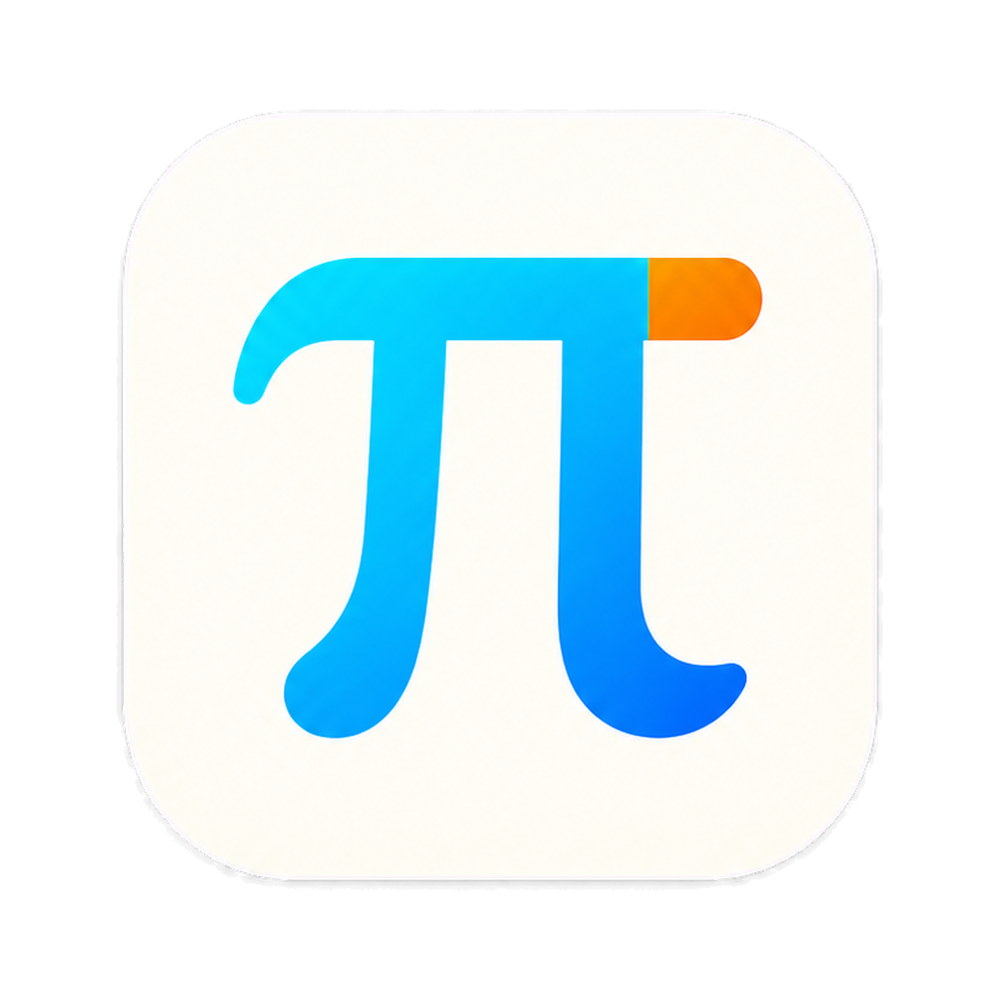
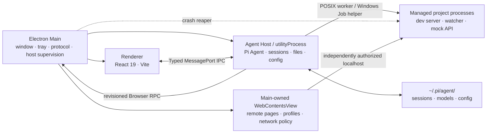

<div align="center">



# Dexon

**Turn your AI coding agent into a true desktop workbench.**

Local-first · No internal servers · Cross-platform


[简体中文](./README.md) · **English**

</div>

## Project Lineage

Dexon is a derivative of [DLYZZT/Pi Agent Desktop](https://github.com/DLYZZT/pi-desktop) (Apache License 2.0, Copyright © DLYZZT), and builds on the original author's work with gratitude. Modification records live in [THIRD_PARTY_NOTICES.md](./THIRD_PARTY_NOTICES.md).

## Core Capabilities

### A complete agent workbench

- Create, switch, rename, and delete sessions with continuously streamed replies
- Auto-generate short session titles from the first message (configurable; manual names always win)
- Search sessions, browse by date, and keep stable session titles in the list and main thread
- Inspect tool calls, execution progress, and context compaction state
- Queued messages, Steer / Follow-up interactions
- Fast switching of model, reasoning level, tool presets, and sound cues
- Image attachments, slash commands, and `@` file references
- Consistent reading width for chat and input; resizable right-hand file panel with remembered width

### A built-in browser shared by user and agent

- Real Chromium pages in a Main-owned `WebContentsView` with multi-tab, temp/persistent profiles, logins, downloads, uploads, and proxy
- Agent browser read/interact grants for navigation, structured snapshots, screenshots, clicks, typing, keyboard, and waits; first use asks via a main-window dialog and Coding permissions never imply browser permissions
- User and agent operate the same page with instant takeover; submissions, downloads, uploads, permissions, and external protocols stay behind local policy or confirmation

### Observable, controllable managed dev processes

- Let the agent run Vite, React, Three.js, Storybook, Flask, Spring Boot, mock APIs, and watch builds via explicit `process_*` tools; ordinary short commands keep using Bash
- The Processes panel shows owner, state, readiness, redacted logs, loopback endpoints, and exit reasons; send stdin lines, stop, force stop, restart, copy, or export logs at any time
- macOS/Linux use POSIX process groups; Windows x64 uses a verified Rust helper and Job Object
- Off by default and not a security sandbox: child processes carry the same native rights as agent Bash; common LAN binds require confirmation

### File experience around your project

- Native project directory picker with Git branch and worktree management
- Browse project files, open tabs, download or reference files
- Code highlighting, Mermaid, KaTeX in agent replies and Markdown, plus Word (`.docx`) preview
- File watching and Git awareness keep sessions close to the current project

### Unified model and extension management

- Bundled Pi Coding Agent 0.84.0 with model provider and model configuration management
- Browser OAuth login flows
- Search, install, and configure Skills; manage Plugins through the Pi extension system

### WeChat, Telegram, and Feishu/Lark channels

- Personal WeChat QR login, Telegram BotFather tokens, and Feishu/Lark apps via App ID/App Secret
- Private-chat pairing plus Telegram and Feishu/Lark group whitelists with @-trigger controls
- External chats default to a separate Pi session, or bind to the current session to share context
- Inbound images, files, and voice; WeChat SILK voice converts to WAV first; Telegram private chats support streaming previews

### Designed for long-running use

- Single instance, system tray, desktop notifications, and Dock / taskbar badges
- Window state memory, theme following, and custom protocol
- Agent host crash recovery, crash reports, and diagnostic export
- `sandbox: true`, strict CSP, and typed IPC contracts

## Getting Started

### Development requirements

- Node.js 22.19 (and below 23)
- npm
- macOS, Windows, or Linux

### Run locally

```bash
git clone <your dexon repository>
cd dexon
npm ci
npm run dev
```

The app reads sessions and configuration from `~/.pi/agent/`. If you already use the Pi CLI, existing data is reused without migration. Dexon discovers and verifies existing Node.js/npm, Python, Git, Bash, uv, jq, and Bun installs; bundled `rg`/`fd` keep search working offline.

> Note: publishing configuration (GitHub Release, website links, app icon) still holds placeholder values pending the first release.

### Build targets

- macOS Apple Silicon (arm64): DMG + ZIP
- macOS Intel (x64): DMG + ZIP
- Windows (x64): NSIS installer
- Linux (x64): AppImage

## Architecture

Dexon uses the Electron three-process model to isolate privileged desktop capabilities, the agent runtime, and the UI.



- **Main**: window lifecycle, menus, tray, notifications, updates, custom protocol, and agent host supervision
- **Agent Host**: runs Pi Coding Agent in a dedicated `utilityProcess`, handling sessions, files, config, and extensions
- **Renderer**: React UI talking to the Host only through the controlled preload bridge
- **Browser View**: remote sites and localhost project pages live only in Main-created sandboxed `WebContentsView`s without app preload, Node, or the main renderer bridge
- **No internal local services**: the app never opens TCP ports for UI or control planes; user-started managed project services may listen on loopback

## Data, Security & Privacy

- Sessions and Pi configuration stay on-device under `~/.pi/agent/`
- No extra local network ports for UI communication
- Electron sandbox enabled in the renderer with a strict Content Security Policy
- Preload exposes only controlled bridge interfaces; Host RPC is bound by TypeScript contracts
- The update client only uses release config compiled into the production package and never accepts renderer-provided update URLs or credentials

## Contributing

| Command                                  | Description                                          |
| ---------------------------------------- | ---------------------------------------------------- |
| `npm run dev`                            | Start Vite, main-process watch build, and Electron  |
| `npm run typecheck`                      | Run TypeScript type checks                           |
| `npm run test`                           | Run the automated test suite                         |
| `npm run check:contract`                 | Check API method vs. Host handler coverage           |
| `npm run smoke`                          | Run the Electron smoke test                          |
| `npm run verify`                         | Full pre-commit quality gate                         |
| `npm run build`                          | Build main, preload, and renderer                    |
| `npm run pack`                           | Produce an unpacked app directory                    |
| `npm run dist`                           | Produce all configured installers for this platform  |

Run at minimum before committing:

```bash
npm run verify
```

### Project structure

```text
src/
├── contract/      # IPC type contracts and RPC layer
├── main/          # Electron main process and crash reaper
├── preload/       # Secure bridge interfaces
├── agent-host/    # Agent, sessions, files, config, managed processes
├── renderer/      # React desktop UI
└── shared/        # Testable pure functions and shared modules
native/
└── windows-managed-process-helper/  # Windows x64 Rust / Job Object helper
```

## License

[Apache License 2.0](./LICENSE)

This project is a derivative of Pi Agent Desktop (Copyright © DLYZZT, Apache License 2.0); modifications are recorded in [THIRD_PARTY_NOTICES.md](./THIRD_PARTY_NOTICES.md) as required by the license.