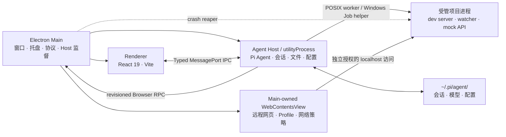

<div align="center">


# Dexon

**把 AI Coding Agent 变成真正的桌面工作台。**

本地优先 · 零内部服务器 · 跨平台应用


**简体中文** · [English](./README.en.md)

</div>

## 项目出处

Dexon 基于 [DLYZZT/Pi Agent Desktop](https://github.com/DLYZZT/pi-desktop)（Apache License 2.0，Copyright © DLYZZT）衍生修改而来，在此感谢原作者的工作。相对上游的改动记录见 [THIRD_PARTY_NOTICES.md](./THIRD_PARTY_NOTICES.md)。

## 核心能力

### 一个完整的 Agent 工作台

- 创建、切换、重命名和删除会话，并持续展示流式回复
- 新会话可根据首条有效消息在后台自动生成简短标题；可在设置中关闭，手动名称始终优先
- 搜索会话、按日期分组浏览，并在列表和主对话顶部使用稳定的会话标题
- 查看工具调用、执行过程和上下文压缩状态
- 支持排队消息、Steer / Follow-up 等交互方式
- 快速切换模型、推理等级、工具预设和提示音
- 支持图片附件、斜杠命令与 `@` 文件引用
- 对话与输入框使用一致的阅读宽度，右侧文件面板可通过鼠标或键盘调整并记住宽度

### 用户与 Agent 共享的内置浏览器

- 在主界面右侧使用 Electron `WebContentsView` 承载真实 Chromium 页面，支持多 Tab、临时/持久 Profile、登录态、下载、上传和代理
- Agent 可在独立的 Browser read/interact 授权下执行导航、结构化页面快照、截图、点击、输入、键盘与等待；首次需要时由主窗口弹窗询问，Coding 权限不会隐式开启浏览权限
- 用户与 Agent 操作同一个页面，并可随时接管；提交、下载、上传、权限和外部协议继续经过本地策略或确认
- 设置页管理全局默认与具体会话的永久权限，授权弹窗只产生当前会话的临时权限；高级浏览器模式由一个仅本次启动有效的本机开关统一控制

### 可观察、可控制的受管开发进程

- 在受支持平台上让 Agent 用显式 `process_*` tools 持续运行 Vite、React、Three.js、Storybook、Flask、Spring Boot、mock API 和 watch build；普通短命令继续走 Bash
- 右侧 Processes 面板展示 owner、状态、readiness、脱敏日志、loopback endpoint 和退出原因；用户可随时发送行式 stdin、停止、强制停止、重启、复制或导出日志
- macOS/Linux 使用 POSIX process group；Windows x64 使用经过完整性校验的 Rust helper 和 Job Object
- 功能默认关闭且不是安全沙箱：子进程拥有与 Agent Bash 相同的本机权限；常见 LAN bind 需要确认

### 围绕项目工作的文件体验

- 原生选择项目目录，管理 Git 分支与 Worktree
- 浏览项目文件、打开多标签页、下载或引用文件
- Agent 回复和 Markdown 文件支持代码高亮、Mermaid、KaTeX，并可预览 Word（`.docx`）文档
- 文件变更监听与 Git 状态感知，让会话始终贴近当前项目

### 模型与扩展统一管理

- 内置 Pi Coding Agent 0.84.0，管理模型提供商和模型配置
- 支持浏览器 OAuth 登录流程
- 搜索、安装和配置 Skills；管理 Plugins，并沿用 Pi Agent 的扩展体系

### 微信、Telegram 与飞书/Lark 消息渠道

- 个人微信二维码登录、Telegram BotFather token，以及飞书/Lark 官方扫码创建新机器人或已有应用 App ID/App Secret 接入
- 私聊配对，以及 Telegram、飞书/Lark 群聊白名单与 @触发控制
- 外部对话默认使用独立 Pi Session，也可从当前会话顶部快速绑定并与 UI 共用上下文
- 支持入站图片、文件和语音；微信 SILK 语音优先转为 WAV；Telegram 私聊支持流式预览

### 为长期运行而设计

- 单实例、系统托盘、桌面通知与 Dock / 任务栏角标
- 窗口状态记忆、系统主题跟随和自定义协议
- Agent Host 异常恢复、崩溃报告与诊断信息导出
- `sandbox: true`、严格 CSP 与类型化 IPC 契约

## 快速开始

### 源码开发环境要求

- Node.js 22.19（且低于 23）
- npm（随 Node.js 安装即可）
- macOS、Windows 或 Linux

### 本地运行

```bash
git clone <你的 dexon 仓库地址>
cd dexon
npm ci
npm run dev
```

应用读取 `~/.pi/agent/` 中的会话与配置。如果你已经使用 Pi CLI，可以直接复用现有数据，无需迁移。Pi Desktop 会先发现并验证已安装的 Node.js/npm、Python、Git、Bash、uv、jq 和 Bun；内置的 `rg`/`fd` 保证离线搜索可用。

> 说明：当前版本的发布配置（GitHub Release、官网链接、应用图标）仍为占位值，待正式发布时更新。

### 构建

- macOS Apple Silicon（arm64）：DMG + ZIP
- macOS Intel（x64）：DMG + ZIP
- Windows（x64）：NSIS 安装程序
- Linux（x64）：AppImage

## 架构设计

Dexon 使用 Electron 三进程模型，将高权限桌面能力、Agent 运行时和 UI 隔离开来。



- **Main**：负责窗口生命周期、菜单、托盘、通知、软件更新、自定义协议和 Agent Host 监督
- **Agent Host**：在独立 `utilityProcess` 中运行 Pi Coding Agent，处理会话、文件、配置与扩展
- **Renderer**：运行 React UI，只通过受控的 preload bridge 与 Host 交互
- **Browser View**：远程站点与 localhost 项目页只进入 Main 创建的沙箱化 `WebContentsView`，不获得应用 preload、Node 或主 Renderer bridge
- **无内部本地服务**：应用不使用 TCP 端口承载 UI 或控制面；用户显式启动的受管项目服务可以监听 loopback

## 数据、安全与隐私

- 会话与 Pi 配置默认留在本机 `~/.pi/agent/`
- 应用不会为了 UI 通信额外开放本地网络端口
- Renderer 开启 Electron sandbox，并使用严格的 Content Security Policy
- preload 只暴露受控桥接接口，Host RPC 由 TypeScript 契约约束
- 更新客户端只使用正式包内固定的公开 GitHub Release 配置，不接收 Renderer 提供的更新地址或发布凭证

## 参与开发

### 常用命令

| 命令                                     | 说明                                          |
| ---------------------------------------- | --------------------------------------------- |
| `npm run dev`                            | 启动 Vite、主进程构建监听与 Electron          |
| `npm run typecheck`                      | 执行 TypeScript 类型检查                      |
| `npm run test`                           | 运行自动化测试套件                            |
| `npm run check:contract`                 | 检查 API 方法与 Host handler 覆盖关系         |
| `npm run smoke`                          | 运行 Electron 冒烟测试                        |
| `npm run verify`                         | 执行提交前的完整质量检查                      |
| `npm run build`                          | 构建 main、preload 与 renderer                |
| `npm run pack`                           | 生成未封装的应用目录                          |
| `npm run dist`                           | 生成当前平台配置的全部架构安装包              |

### 项目结构

```text
src/
├── contract/      # IPC 类型契约与 RPC 层
├── main/          # Electron 主进程与 crash reaper
├── preload/       # 安全桥接接口
├── agent-host/    # Agent、会话、文件、配置与受管进程
├── renderer/      # React 桌面界面
└── shared/        # 可测试的纯函数与共享模块
native/
└── windows-managed-process-helper/  # Windows x64 Rust / Job Object helper
```

提交代码前请至少运行：

```bash
npm run verify
```

## License

[Apache License 2.0](./LICENSE)

本项目衍生自 Pi Agent Desktop（Copyright © DLYZZT，Apache License 2.0），并已按协议要求在 [THIRD_PARTY_NOTICES.md](./THIRD_PARTY_NOTICES.md) 中注明改动。